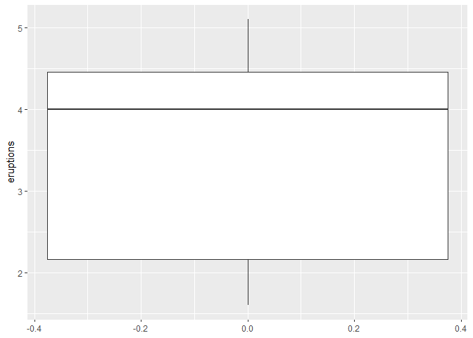
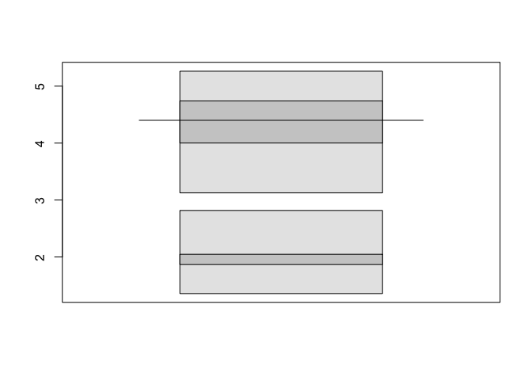
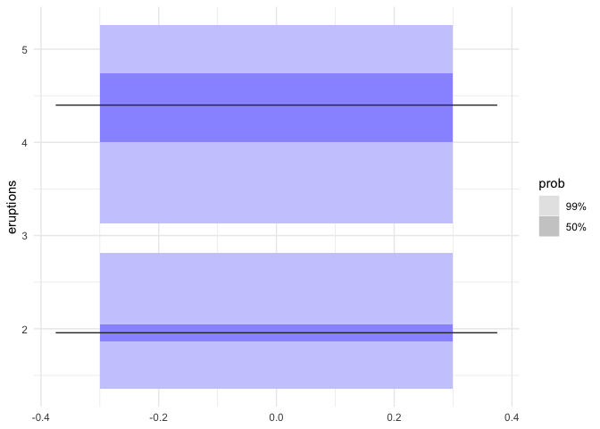
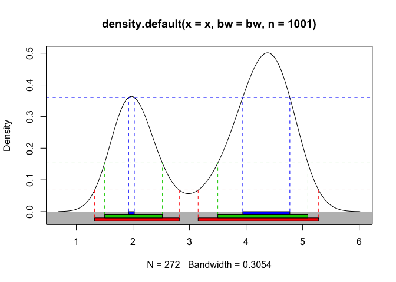
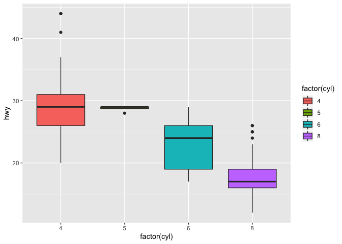
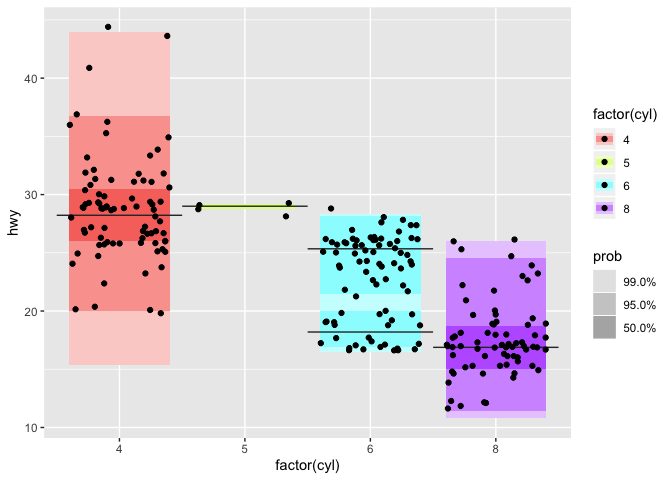
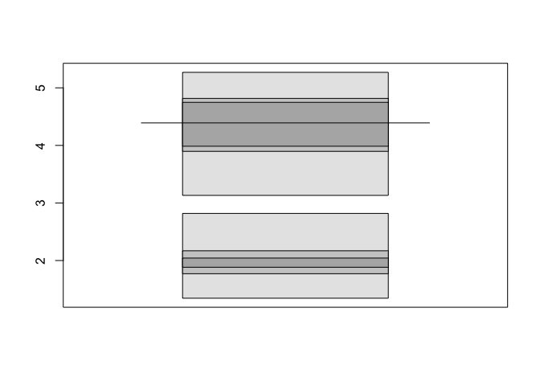
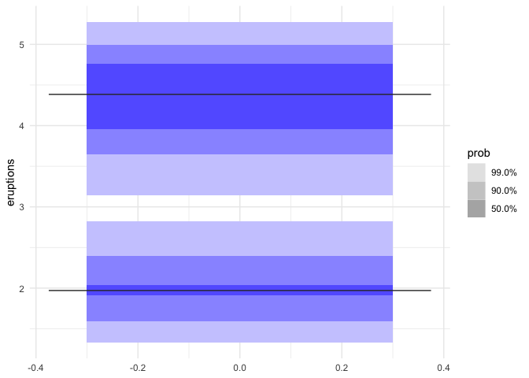
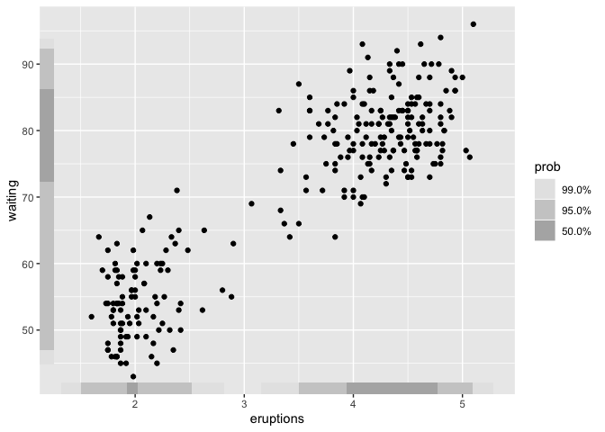
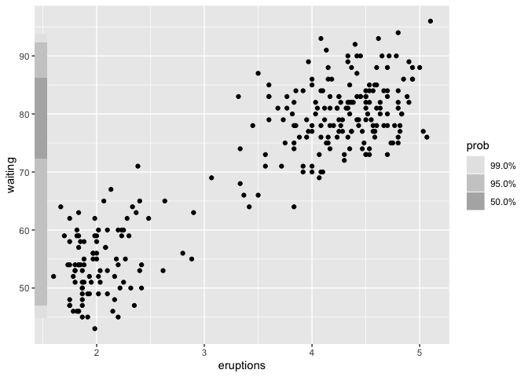

<!-- README.md is generated from README.Rmd. Please edit that file -->

# gghdr 

Package `gghdr` imports the package
[`hdrcde`](https://pkg.robjhyndman.com/hdrcde/) and provides tools for
plotting highest density regions in the ggplot2 framework.

<!-- badges: start -->

[](https://www.tidyverse.org/lifecycle/#experimental)
<!-- badges: end -->

# Traditional boxplot

  - central box bounded by Q1 and Q3 representing the interquartile
    range
  - whiskers extending from Q1 - 1.5(Q3 - Q1) to Q3 + to 1.5(Q3 - Q1),
    representing 99% coverage for large samples
  - median represented by a horizontal line

<!-- end list -->

    #> This is hdrcde 3.3

<!-- -->

# hdr.boxplot (Existing)

There are different ways to summarize a distribution but the highest
density region allows the display of multimodality.

  - Region bounded by the interquartile range is replaced by 50% HDR
  - Region bounded by the whiskers is replaced by the 99% HDR
  - The mode is represented by a horizontal
line

<!-- In both HDR and box plots, the interquartile range or 50% HDR will have a coverage probability of 50%. -->

``` r
library(hdrcde)
hdr.boxplot(faithful$eruptions)
```

<!-- -->

<!-- # ```{r hdrcde-boxplot_more, echo=TRUE, eval = FALSE} -->

<!-- # hdr.boxplot(x, prob = c(99, 50), h = hdrbw(BoxCox(x, lambda), -->

<!-- #   mean(prob)), lambda = 1, boxlabels = "", col = gray((9:1)/10), -->

<!-- #   main = "", xlab = "", ylab = "", pch = 1, border = 1, -->

<!-- #   outline = TRUE, space = 0.25, ...) -->

<!-- # ``` -->

# geom\_boxplot\_hdr (Proposal)

``` r
library(ggplot2)
library(gghdr)
ggplot(faithful, aes(y = eruptions)) +  
  geom_hdr_boxplot(position = "identity")
```

<!-- -->

# hdr.den (Existing)

  - a density plot
  - the endpoints of each interval in each HDR on the x-axis
  - a straight line showing value of the density at the boundaries of
    each HDR

<!-- end list -->

``` r
hdr.den(faithful$eruptions)
```

<!-- -->

    #> $hdr
    #>         [,1]     [,2]     [,3]     [,4]
    #> 99% 1.324419 2.819321 3.151319 5.281695
    #> 95% 1.500878 2.520609 3.500000 5.091276
    #> 50% 1.923179 2.024209 3.944160 4.771010
    #> 
    #> $mode
    #> [1] 4.381393
    #> 
    #> $falpha
    #>         1%         5%        50% 
    #> 0.06711024 0.15275374 0.36217467
    #ggplot(faithful, aes(x=eruptions)) +  geom_density()

# gg\_hdr (Proposal)

  - geom\_density() - to represent the density
  - geom\_hdr\_rug() - The endpoints of each interval in each HDR on the
    x-axis
  - geom\_hline() - The value of the density at the boundaries of each
    HDR

gghdr() = geom\_density() + geom\_hdr\_rug() + geom\_hline()

``` r
library(ggplot2)
faithful %>% ggplot(aes(y = , x = )) +  geom_hdr()
```

# Rough testing code

``` r
library(tidyverse)
#> ── Attaching packages ──────────────────────────────────── tidyverse 1.2.1 ──
#> ✓ tibble  2.1.3     ✓ purrr   0.3.3
#> ✓ tidyr   1.0.0     ✓ dplyr   0.8.3
#> ✓ readr   1.3.1     ✓ stringr 1.4.0
#> ✓ tibble  2.1.3     ✓ forcats 0.4.0
#> ── Conflicts ─────────────────────────────────────── tidyverse_conflicts() ──
#> x dplyr::filter() masks stats::filter()
#> x dplyr::lag()    masks stats::lag()

p <- ggplot(mpg, aes(y = hwy, fill = factor(cyl), x = factor(cyl)))
p + geom_boxplot()
```

<!-- -->

``` r
p + geom_hdr_boxplot(width = 1) + geom_jitter()
```

<!-- -->

``` r


as_tibble(faithful) %>% 
  ggplot(aes(y = eruptions)) + 
  geom_boxplot()
```

<!-- -->

``` r

hdrcde::hdr.boxplot(faithful$eruptions, prob = c(50,70, 99))
```

<!-- -->

``` r


#devtools::load_all("../ggplot2/")
ggplot(faithful, aes(y = eruptions)) + 
  geom_hdr_boxplot(prob = c(.5,.90, 0.99), fill = "blue") + 
  theme_minimal()
```

<!-- -->

``` r


ggplot(faithful, aes(x = eruptions, y = waiting)) + 
  geom_point() + 
  geom_hdr_rug()
```

<!-- -->

``` r

ggplot(faithful) +
  geom_point(aes(x = eruptions, y = waiting)) + 
  geom_hdr_rug(aes(y = waiting))
```

<!-- -->

``` r


library(hdrcde)
hdr(c(rnorm(100), rnorm(100, 4)), all.modes = TRUE)
#> $hdr
#>           [,1]     [,2]
#> 99% -2.1920594 6.409053
#> 95% -1.5676404 5.788330
#> 50%  0.1370447 4.094451
#> 
#> $mode
#> [1] 2.121572
#> 
#> $falpha
#>         1%         5%        50% 
#> 0.05688177 0.06786559 0.09384715
```
