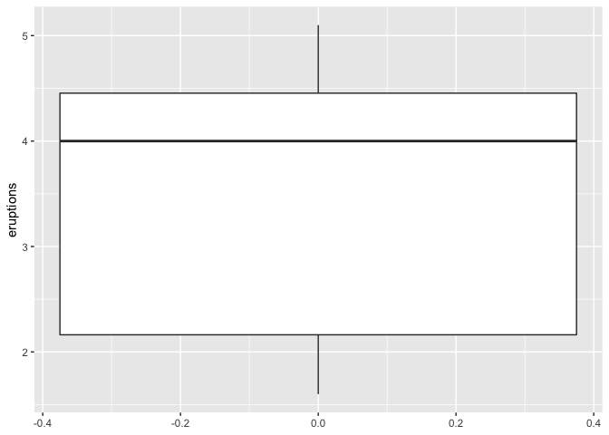
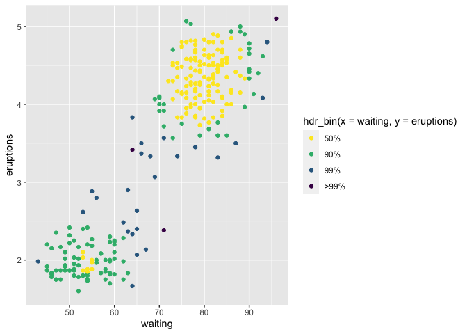

<!-- README.md is generated from README.Rmd. Please edit that file -->

# gghdr 

<!-- badges: start -->

[](https://lifecycle.r-lib.org/articles/stages.html#stable)
[](https://github.com/Sayani07/gghdr/actions)
<!-- [](https://codecov.io/gh/ropenscilabs/gghdr?branch=master) -->
<!-- badges: end -->

Package `gghdr` helps to visualize Highest Density Regions (HDR) in one
and two dimensions. HDRs are useful in displaying multimodality in the
distribution. This work draws inspiration from the the package
[`hdrcde`](https://pkg.robjhyndman.com/hdrcde/) developed by [Rob
Hyndman](https://robjhyndman.com/) and provide a framework for
displaying HDRs under `ggplot2` framework.

# Installation

You could install the stable version on CRAN:

``` r
install.packages("gghdr")
```

You could install the development version from Github using:

``` r
# install.packages("remotes")
remotes::install_github("Sayani07/gghdr")
```

# An overview of gghdr

There are several statistical methods to summarize a distribution by
region of the sample space covering certain probability. For example, in
a traditional boxplot, the central box bounded by the interquartile
range represents 50% coverage and whiskers represent 99% coverage for
large samples. The method of summarizing a distribution using highest
density regions is useful for analysing multimodal distributions. We
illustrate this by exploring the data set `faithful` which contains the
waiting time and duration of eruptions for the old faithful geyser in
the Yellowstone National Park, USA.

``` r
library(ggplot2)
ggplot(faithful, aes(y=eruptions)) + geom_boxplot()
```



<!-- In both HDR and box plots, the interquartile range or 50% HDR will have a coverage probability of 50%. -->

<!-- # ```{r hdrcde-boxplot_more, echo=TRUE, eval = FALSE} -->
<!-- # hdr.boxplot(x, prob = c(99, 50), h = hdrbw(BoxCox(x, lambda), -->
<!-- #   mean(prob)), lambda = 1, boxlabels = "", col = gray((9:1)/10), -->
<!-- #   main = "", xlab = "", ylab = "", pch = 1, border = 1, -->
<!-- #   outline = TRUE, space = 0.25, ...) -->
<!-- # ``` -->

We can use `geom_hdr_boxplot` to display the same variable. Along with
displaying the 99% and 50% highest density regions, it also shows the
local mode in each of the regions. This shows that eruption times are
likely to be around 4.5 minutes or 2 minutes, but rarely for around 3
minutes. This insight was not apparent in the above boxplot.

``` r
library(gghdr)
library(ggplot2)
ggplot(faithful, aes(y = eruptions)) + 
  geom_hdr_boxplot(prob = c(.5, 0.99), fill = "blue") + 
  theme_minimal()
```


It can be interesting to supplement a scatterplot with marginal
distributions of one or both variables to enhance insights into the
relationship between the two variables. This is possible through
`geom_hdr_rug`. This shows two clear clusters, one with shorter waiting
times and shorter eruptions (around 2 minutes) and another with longer
waiting times and longer eruptions (around 4.5 minutes). The
`geom_hdr_rug` adds to this information by displaying the highest
density region of eruption time covering 50% and 99%.

<!-- eruptions with longer waiting times tend to be longer in duration (around 4.5 minutes) and with shorter waiting times are most likely to last shorter (around 2 minutes).  -->

``` r
ggplot(faithful) +
  geom_point(aes(x = eruptions, y = waiting)) + 
  geom_hdr_rug(aes(x = eruptions), prob = c(0.99, 0.5), fill = "blue")
```


The previous example can be extended to allow displaying the scatterplot
with points coloured according to the bivariate highest density regions
using `hdr_bin`.`hdr_bin` can also be mapped to only the x-axis or
y-axis to show the marginal distribution of any one variable. This
figure enriches the information in the scatterplot by emphasizing the
highest bivariate density regions covering 50%, 90%, 99%, and more than
99% coverage.

``` r
ggplot(data = faithful, aes(x = waiting, y=eruptions)) +
  geom_point(aes(colour = hdr_bin(x = waiting, y = eruptions))) +
  scale_colour_viridis_d(direction = -1) 
```



You can read more about gghdr in the
[vignette](https://sayani07.github.io/gghdr/).

[](https://ropensci.org)
